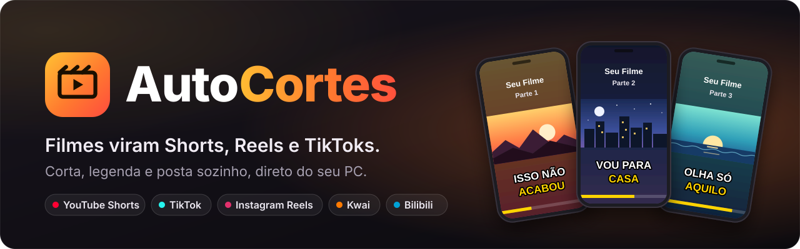
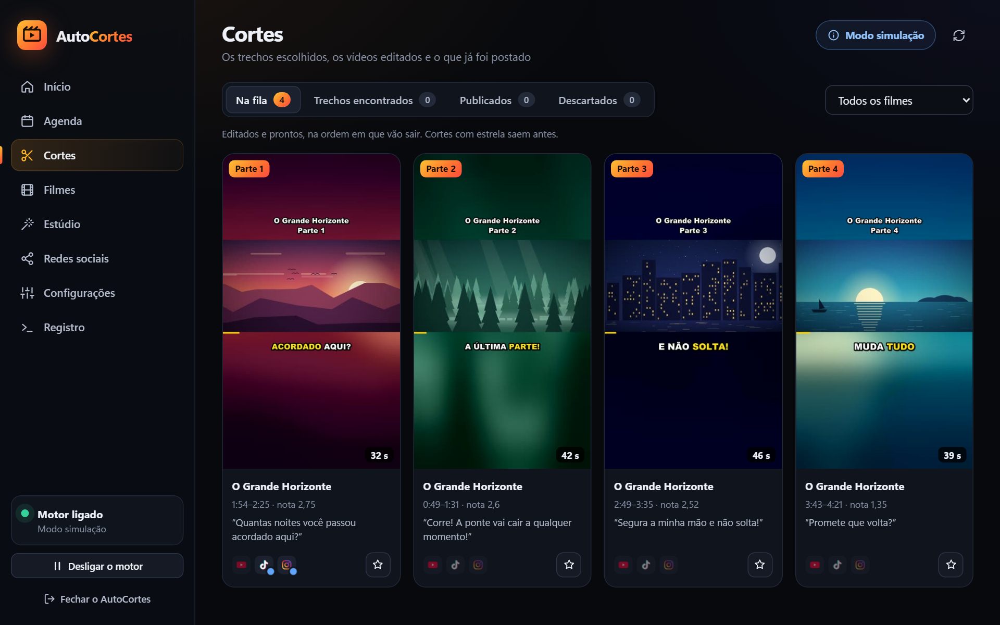
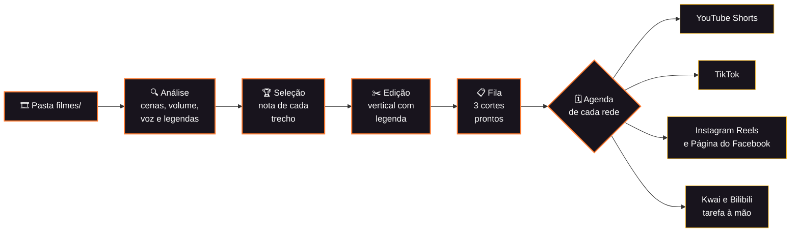
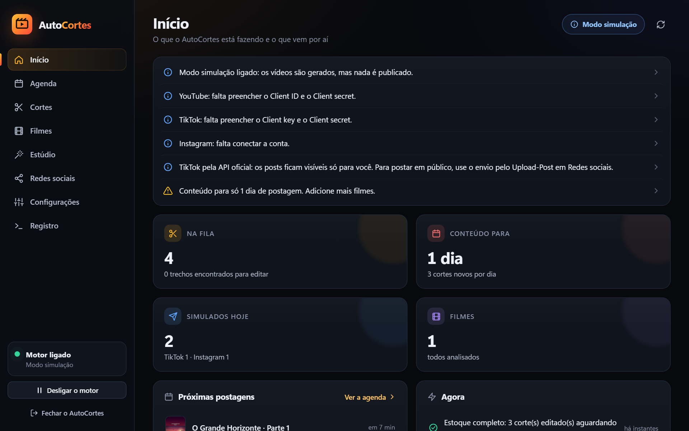
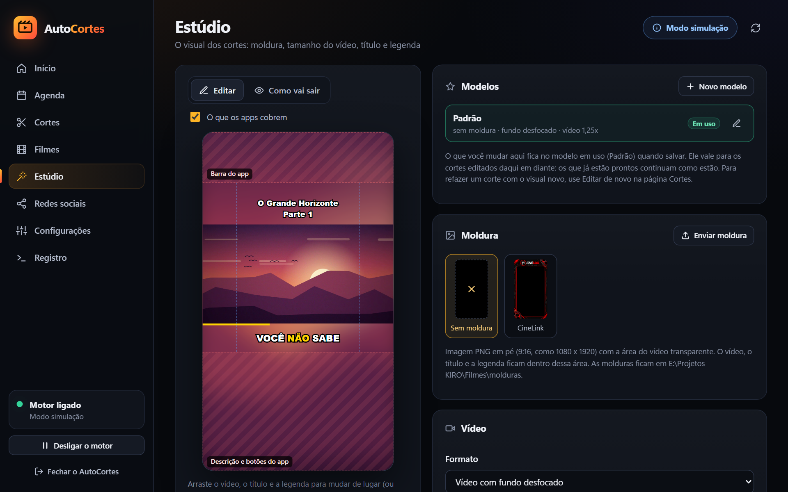
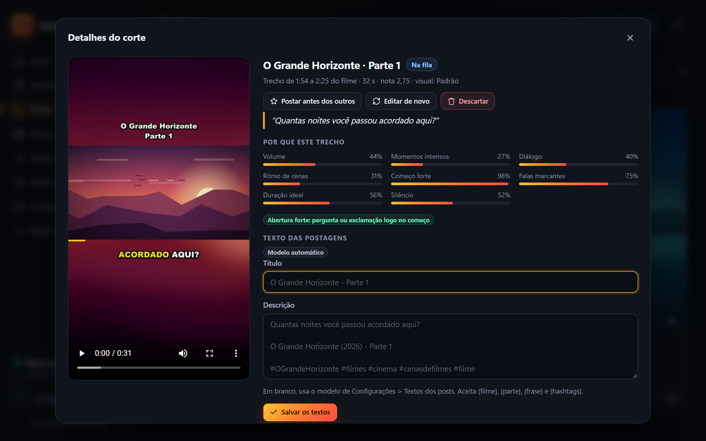
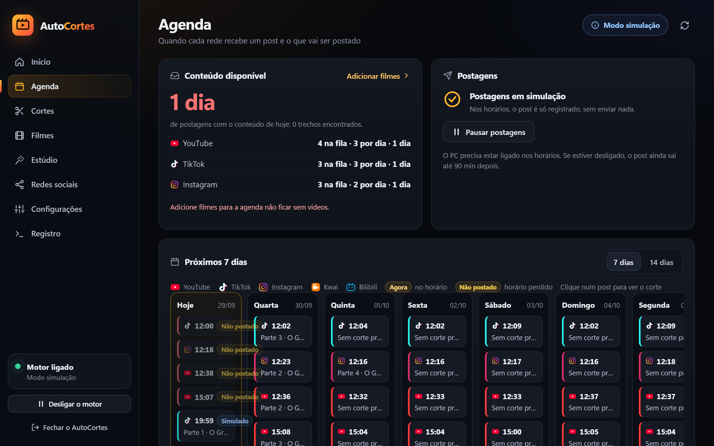

<div align="center">



<br>

**Corta filmes em vídeos verticais com legenda palavra por palavra e posta sozinho, na agenda de cada rede.**<br>
Roda no seu PC com Windows, com FFmpeg e whisper.cpp. Os vídeos só saem do computador para as redes que você conectar.

[](https://www.python.org/downloads/)
[](https://ffmpeg.org/)
[](https://github.com/ggml-org/whisper.cpp)
[](https://sqlite.org/)
[](#instalação-e-uso)
[](#situação-atual)

[Como funciona](#como-funciona) · [Instalação](#instalação-e-uso) · [Painel](#painel) · [Redes sociais](#redes-sociais) · [Agenda](#agenda-de-postagens) · [Configuração](#configuração) · [Próximos passos](#pendências-e-próximos-passos)

</div>

<br>

<p align="center">
  
</p>
<p align="center"><sub>A página Cortes do painel. O filme de exemplo foi gerado só para estas imagens: ilustrações, voz sintetizada do Windows e legenda própria.</sub></p>

## O que é

O AutoCortes corta filmes, edita em formato vertical e publica sozinho no **YouTube Shorts**, **TikTok** e **Instagram Reels** (e, se você quiser, na **Página do Facebook** junto com o Instagram), em loop e seguindo uma agenda. No **Kwai** e no **Bilibili**, que não têm API de postagem aberta, ele prepara cada post e você publica pelo app ou pelo site. Você coloca os filmes numa pasta; o sistema analisa cada um, escolhe os melhores trechos, edita com legenda palavra por palavra e posta nos horários de cada rede, sempre com alguns vídeos prontos na fila.

Tudo roda no seu PC com Windows, usando FFmpeg e whisper.cpp. Os vídeos só saem do computador para as redes que você conectar.

> [!WARNING]
> Cortes de filmes protegidos geram Content ID, strikes e bloqueio de conta, e as redes tratam trecho de filme com pouca edição como conteúdo não original. Use filmes em domínio público, Creative Commons, próprios ou licenciados. Detalhes em [Direitos autorais e originalidade](#direitos-autorais-e-originalidade).

<table>
<tr>
<td width="33%" valign="top">

**🎬 Escolhe os melhores trechos**<br>
Cada trecho de 30 a 60 s ganha nota por volume, picos, diálogo, ritmo de cenas e começo forte. O corte começa e termina numa troca de cena ou numa pausa da fala.

</td>
<td width="33%" valign="top">

**💬 Legenda palavra por palavra**<br>
Transcrição com o whisper.cpp no seu PC, cada palavra encaixada na voz detectada e destaque amarelo na palavra que está sendo dita.

</td>
<td width="33%" valign="top">

**📱 Vertical pronto para postar**<br>
1080x1920 com fundo desfocado ou moldura, nome do filme e "Parte N" no topo, barra de progresso, fade e áudio em -14 LUFS.

</td>
</tr>
<tr>
<td valign="top">

**🗓️ Agenda por rede**<br>
Horários e dias próprios em cada rede, com variação aleatória, intervalo mínimo e limite de posts por dia.

</td>
<td valign="top">

**🔁 Loop sem parar**<br>
Mantém 3 cortes prontos à frente das postagens e volta aos filmes já analisados quando acabam os novos.

</td>
<td valign="top">

**🖥️ Painel no navegador**<br>
9 telas, com o Estúdio para ajustar o visual numa tela de celular, o calendário da semana e o registro ao vivo.

</td>
</tr>
<tr>
<td valign="top">

**✋ Postagem à mão quando não há API**<br>
No Kwai e no Bilibili, cada horário vira uma tarefa com o vídeo e os textos no formato da rede. Você posta e marca "Já postei".

</td>
<td valign="top">

**🤖 IA opcional e local**<br>
Título, descrição e hashtags escritos pelo Ollama no seu PC, ou por qualquer API compatível com a da OpenAI.

</td>
<td valign="top">

**🔒 Seu PC, suas contas**<br>
Painel só em 127.0.0.1, com token por sessão, e logins das redes cifrados com a proteção de dados do Windows.

</td>
</tr>
</table>

## Como funciona



1. **Pasta de filmes.** A cada 5 min o sistema procura vídeos novos em `filmes/` (mp4, mkv, avi, mov, webm, ts e outros). Título e ano saem do nome do arquivo: `O.Poderoso.Chefao.1972.1080p.BluRay.mkv` vira "O Poderoso Chefao", de 1972. Episódio de série (`S01E01` ou `1x01`) vira "Nome T1:E1".
2. **Análise**, uma vez por filme e com cache (se parar no meio, continua de onde estava):
   - tarjas pretas, trocas de cena, volume a cada 0,5 s e trechos com voz;
   - legendas: `.srt` ao lado do filme, senão a legenda embutida (de texto), senão transcrição com Whisper. Em arquivo com áudio dublado ("Dual", com dois idiomas, ou "Dublado" no nome), a legenda embutida costuma ser a tradução do original e não bate com a dublagem, então a fala dublada é transcrita; se a transcrição falhar, a legenda embutida entra no lugar. Uma faixa com poucas falas para o filme (só os letreiros, mesmo sem a marca "forced") é pulada, e entre duas faixas em português a do Brasil vem antes;
   - pula a abertura e os créditos finais (até 90 s no início e 7 min no fim).
3. **Seleção.** Cada trecho de 30 a 60 s recebe uma nota: volume, picos de intensidade, diálogo, ritmo de cenas, começo forte, falas com ! e ? e palavras-chave. Perde nota o corte que abre com "então", "mas" ou "aí", ou que pega uma frase pela metade. O corte começa e termina numa troca de cena ou numa pausa da fala. São até 40 cortes por filme, sem sobreposição.
4. **Edição.** Vídeo 1080x1920 com o visual do modelo em uso (veja [Estúdio](#painel), abaixo): moldura opcional por cima, filme no centro sobre fundo desfocado ou preto (ou preenchendo a área), legenda palavra por palavra com destaque amarelo, nome do filme e "Parte N" no topo, barra de progresso, fade e áudio normalizado em -14 LUFS. Por padrão, título e legenda ficam na área que os apps não cobrem e diminuem sozinhos quando o texto é comprido. A legenda não separa palavras que andam juntas: "PARA A CASA" sai inteiro, nunca "VOU PARA / A CASA".
5. **Aprovação (opcional).** Com `exigir_aprovacao = true`, cada corte editado espera você aprovar antes de entrar na fila.
6. **Publicação.** No horário de cada rede, o próximo corte da fila sai com título, descrição e hashtags montados por modelo, ou escritos pela IA, se ela estiver ligada. O mesmo corte vai para todas as redes ativas, cada uma no seu horário e com o mesmo texto. Nas redes à mão, o horário vira uma tarefa no Início (veja [Postagem à mão](#postagem-à-mão-kwai-bilibili-e-qualquer-rede)).
7. **Loop.** O sistema mantém 3 cortes editados à frente das postagens. Quando acabam os filmes novos, volta aos já analisados e procura trechos ainda não usados; quando não sobra nada, avisa para você adicionar filmes.

> [!TIP]
> O **modo simulação** vem ligado: gera todos os vídeos, mas não envia nada, e o registro mostra o que teria sido postado.

## Situação atual

Atualizado em setembro de 2026.

| Parte | Situação |
|---|---|
| Análise dos filmes e escolha dos trechos | ✅ Pronta e testada |
| Edição vertical (legenda, título, barra, áudio) | ✅ Pronta e testada |
| Envio para YouTube, TikTok e Instagram pela API oficial | 🧪 Pronto; testado contra um servidor simulado, ainda não nas APIs reais |
| Envio pelo Upload-Post (opcional, por rede) | 🧪 Pronto; testado contra um servidor simulado, ainda não no serviço real |
| Envio pelo seu navegador (YouTube, TikTok, Instagram, Bilibili) | ⚠️ Mecânica pronta e testada com o Chrome real; cada roteiro só dá para validar com a conta logada, no ensaio |
| "Aprender a postar": grava o roteiro enquanto você posta à mão | ⚠️ Pronto e testado com o Chrome real; a gravação de cada rede depende da conta logada |
| Roteiro como linguagem simples, editável no painel | ✅ Pronto e testado |
| Instagram também na Página do Facebook (opcional) | 🧪 Pronto, pela API oficial e pelo Upload-Post; testado contra um servidor simulado |
| Kwai, Bilibili e postagem à mão em qualquer rede | ✅ Pronto e testado: tarefas no Início com vídeo, textos por rede, "Já postei" e pasta sincronizada |
| YouTube só com Shorts (vertical ou quadrado, até o limite de duração) | ✅ Pronto e testado |
| Agenda por rede, fila e planejador | ✅ Pronto e testado de ponta a ponta em simulação |
| Painel no navegador (9 telas, API local com 59 rotas) | ✅ Pronto e testado no Edge |
| Perfis de nicho: vários nichos na mesma instalação, cada um com suas contas | ✅ Pronto e testado (dois perfis abertos ao mesmo tempo, de verdade) |
| Vídeos criados do zero: narração, imagens de fundo e legenda no tempo da voz | ✅ Pronto e testado de ponta a ponta pelo comando `criar` (narração no serviço real) |
| Pauta escrita à mão (`pautas/*.txt`) | ✅ Pronta e testada |
| IA escrevendo a pauta sozinha, com agenda e painel | 🚧 A fazer (hoje o vídeo criado sai pelo terminal, fora da fila) |
| Moldura, modelos visuais e aba Estúdio | ✅ Prontos; testados com o episódio de The Great e conferidos quadro a quadro |
| IA opcional para título, descrição e hashtags | 🧪 Pronta; testada com um servidor que imita o Ollama, ainda não com um modelo real |
| Métricas dos posts (YouTube e Instagram) | 🧪 Prontas; testadas contra um servidor simulado |
| `AutoCortes.bat`, `AutoCortes.pyw` e "Iniciar com o Windows" | ✅ Prontos e testados |

✅ pronto e testado · 🧪 pronto, testado só contra um servidor simulado

Falta a primeira postagem real em cada rede: tudo foi testado em modo simulação ou contra servidores simulados.

## Instalação e uso

Requisitos:
- Windows 10 ou 11, 64 bits
- Python 3.11 ou mais novo (testado no 3.14)
- FFmpeg com libass no PATH (testado com o 9.0.2 "full build" do gyan.dev)
- Internet no primeiro uso, para baixar o whisper.cpp (versão b5130, com SHA-256 conferido) e o modelo de transcrição

```powershell
git clone https://github.com/irwagner/AutoCortes.git
cd AutoCortes
.\AutoCortes.bat
```

Sem o Git, use **Code > Download ZIP** no GitHub e extraia a pasta.

**Para abrir, dê dois cliques no `AutoCortes.bat`.** Na primeira vez ele cria o ambiente do Python, instala as bibliotecas e cria o `config.toml` a partir do `config.example.toml`; depois abre o painel no navegador em `http://127.0.0.1:8777`, já com o motor ligado. A janela preta mostra o registro: fechar a janela (ou usar "Fechar o AutoCortes" no painel) desliga tudo. Se o AutoCortes já estiver aberto, o `.bat` só abre o painel de novo.

**Iniciar com o Windows:** ligue em Configurações > Sistema. O AutoCortes passa a abrir em segundo plano quando você entra no Windows, pelo `AutoCortes.pyw`, sem janela e sem abrir o navegador. Para ver o painel, abra o `AutoCortes.bat`. Se algo impedir a abertura, aparece uma caixa com o motivo.

Para publicar de verdade:
1. Em Redes sociais, siga o passo a passo de cada rede e conecte as contas (ou escolha o envio pelo Upload-Post).
2. Clique em Testar em cada rede.
3. Clique em "Ativar a publicação real" no topo de Redes sociais.

Pelo terminal também funciona:

```powershell
.venv\Scripts\python -m autocortes init        # cria o config.toml e as pastas
.venv\Scripts\python -m autocortes verificar   # confere FFmpeg, whisper, fonte e logins
.venv\Scripts\python -m autocortes rodar       # loop sem painel (Ctrl+C para parar)
```

Comandos, todos no formato `.venv\Scripts\python -m autocortes <comando>`:

| Comando | O que faz |
|---|---|
| `painel [--sem-navegador] [--motor-desligado] [--porta N]` | abre o painel; é o padrão quando não há comando |
| `rodar` | loop contínuo sem painel |
| `status` | filmes, cortes, redes e últimas postagens |
| `criar [pauta]` | gera um vídeo do zero a partir de uma pauta de `pautas/` |
| `auth <rede>` | conecta youtube, tiktok ou instagram (Kwai e Bilibili não conectam: são à mão) |
| `verificar [--online]` | confere a instalação e testa os logins |
| `baixar` | baixa o whisper.cpp e os modelos agora |
| `analisar [--filme N]` | analisa filmes novos sem postar |
| `renderizar [-n N]` | edita os próximos N cortes |
| `cortes [--filme N]` | lista os cortes e as notas |
| `reanalisar N [--tudo]` | refaz a análise de um filme |
| `postar <rede> [--corte N] [--real]` | publica um corte agora, fora da agenda; numa rede à mão, cria a tarefa |

Opções gerais: `--config <arquivo>` usa outra configuração e `--detalhado` registra os comandos do FFmpeg no log.

## Painel

Abre no navegador pelo `AutoCortes.bat`. A lateral mostra se o motor está ligado, com botões para ligar, desligar e fechar o AutoCortes; o topo mostra se está em simulação ou publicando de verdade.

<table>
<tr>
<td width="50%" valign="top"><a href="docs/painel-inicio.png"></a><br><sub><b>Início:</b> avisos, fila, dias de conteúdo e posts de hoje</sub></td>
<td width="50%" valign="top"><a href="docs/painel-estudio.png"></a><br><sub><b>Estúdio:</b> o visual do corte numa tela de celular</sub></td>
</tr>
<tr>
<td valign="top"><a href="docs/painel-corte.png"></a><br><sub><b>Detalhe do corte:</b> vídeo, por que o trecho foi escolhido e textos do post</sub></td>
<td valign="top"><a href="docs/painel-agenda.png"></a><br><sub><b>Agenda:</b> conteúdo por rede e calendário da semana</sub></td>
</tr>
</table>

- **Início:** avisos do que falta configurar, as tarefas de postagem à mão (com o número no menu), cortes na fila, dias de conteúdo, posts de hoje, próximas postagens, o que está sendo feito agora (com progresso), últimas postagens, desempenho dos últimos 7 dias e a situação de cada rede.
- **Agenda:** calendário de 7 ou 14 dias com cada horário e o corte previsto, dias de conteúdo por rede, pausa geral, horários e dias de cada rede, presets e regras (variação, tolerância, intervalo, limites e tentativas).
- **Cortes:** abas por situação (aguardando aprovação, na fila, encontrados, publicados e descartados), filtro por filme e aprovar todos. O detalhe de cada corte tem o vídeo, por que o trecho foi escolhido, os textos do post (editar, gerar com IA, ver como o post sai), a situação em cada rede (e na Página do Facebook) com "Postar agora", "Postar à mão" ou "Ver a tarefa", e o histórico.
- **Filmes:** enviar filmes e legendas arrastando para a página, situação e progresso da análise, reanalisar, ignorar e editar título, ano, hashtags e idioma.
- **Redes sociais:** modo simulação ou publicação real, forma de envio de cada rede (API oficial, Upload-Post, pelo navegador ou à mão), conectar (YouTube e TikTok pelo navegador, Instagram colando o token), testar e desconectar, com passo a passo e as opções dos posts (duração máxima do YouTube, Página do Facebook, tags do Bilibili), mais a pasta sincronizada da postagem à mão. Nas redes pelo navegador, "Aprender a postar" grava o roteiro com log ao vivo, desfazer e recomeçar, e "Ver o roteiro" abre o editor da [linguagem de roteiro](#aprender-a-postar-e-o-roteiro).
- **Estúdio:** o visual dos cortes numa tela de celular. Arraste o vídeo, o título e a legenda para cima e para baixo (ou use as setas do teclado), escolha ou envie a moldura, o tamanho do vídeo (Menor, Inteiro com o quadro todo, Padrão de 1,25x e Maior de 1,7x, ou o valor exato), o fundo, a fonte, o tamanho e as cores do título e da legenda, a barra e o fade. "O que os apps cobrem" mostra as faixas onde ficam os botões e a descrição das redes, e "Como vai sair" mostra o quadro gerado pelo mesmo editor dos cortes.
- **Perfis:** vários nichos na mesma instalação ([veja abaixo](#perfis-vários-nichos-de-uma-vez)), cada um com sua pasta, suas contas e seu tema. Criar, abrir, fechar, ajustar portas e excluir, com o limite de quantos trabalham ao mesmo tempo.
- **Configurações:** abas Geral, Cortes, Vídeo (qualidade e volume), Textos dos posts, IA, Transcrição e Sistema, com exemplo do post, teste da IA, download do modelo de transcrição e iniciar com o Windows. As alterações ficam pendentes numa barra no rodapé até você salvar (Ctrl+S também salva).
- **Registro:** mensagens ao vivo, com busca, filtro de avisos e erros e cópia.

As alterações valem na hora, sem reiniciar, exceto a porta do painel e a pasta de dados: essas pedem para fechar e abrir o AutoCortes, e o painel avisa.

### Perfis: vários nichos de uma vez

Um **perfil** é um nicho com a pasta dele: filmes, contas das redes, tema, agenda, fila e histórico separados, e uma janela do Chrome só dele, para as contas não se misturarem. Assim dá para tocar Filmes, Motivacional e Receitas ao mesmo tempo, na mesma instalação, sem nada vazar de um para o outro.

Na tela **Perfis**, "Novo perfil" cria a pasta com um `config.toml` próprio, uma pasta de filmes vazia e portas livres para o painel e para o navegador. O perfil novo começa **em simulação e sem nenhuma rede ligada**: você abre o painel dele, conecta as contas daquele nicho, escolhe o tema no Estúdio e só então desliga a simulação.

```
AutoCortes/
  config.toml, dados/, filmes/        o perfil Principal (o que sempre existiu)
  perfis/motivacional/config.toml, dados/, filmes/
  perfis/receitas/config.toml, dados/, filmes/
  ferramentas/, modelos/              compartilhados: FFmpeg e whisper servem a todos
```

Cada perfil roda no **seu próprio processo**, com o painel numa porta própria. Abrir, fechar e ver a situação de todos é pela tela Perfis, de dentro de qualquer perfil; "Abrir o painel" leva ao painel daquele nicho.

- **Quantos ao mesmo tempo:** cada perfil aberto usa FFmpeg e whisper por conta própria, então o limite é do seu PC. O campo em Perfis define quantos podem trabalhar juntos (0 = sem limite); com um Ryzen 5 e 16 GB, 2 ou 3 é razoável. O limite vale para abrir à mão e para o "Abre junto".
- **Abre junto:** marque em Ajustar e o perfil sobe quando o principal abre, respeitando o limite. O "Iniciar com o Windows" continua sendo um só: ele abre o principal, que abre os marcados.
- **Portas:** cada perfil precisa de uma porta de painel e uma de navegador só dele. O AutoCortes escolhe portas livres ao criar e recusa salvar uma porta que já é de outro perfil. Se duas coincidirem (config editado à mão), a tela avisa em vermelho e o envio pelo navegador **para** em vez de postar com a conta do outro perfil.
- **Login do TikTok:** a porta de retorno (8765) é registrada no app da rede, então é a mesma em todos os perfis. Conecte um perfil por vez.
- **Excluir** apaga a pasta do perfil inteira (vídeos, cortes, histórico e acessos salvos), sem volta: o painel mostra o que será apagado e pede o nome escrito para confirmar. As contas nas redes continuam existindo.

### Moldura e modelos visuais

Um **modelo visual** é um conjunto com nome de tudo que define a cara do corte: moldura, tamanho e altura do vídeo, fundo, título, legenda, barra e fade. O modelo em uso vale para os próximos cortes editados; os que já estão prontos continuam como saíram (para refazer um com o visual novo, use Editar de novo na página Cortes). Cada corte guarda o nome do modelo com que foi editado, e o detalhe dele mostra.

A **moldura** é uma imagem PNG em pé (9:16, como 1080x1920) com a área do vídeo transparente. O AutoCortes acha essa área sozinho, põe o filme e os textos dentro dela e desenha a moldura por cima. As molduras ficam na pasta `molduras/` (dá para enviar pelo Estúdio). O filme passa uns pixels por baixo da borda, para não sobrar fresta. Se o arquivo sumir, não abrir ou não tiver área transparente, os cortes saem sem moldura e o Início avisa.

Na posição automática, a legenda fica abaixo do vídeo quando cabe na faixa que os guias de anúncio consideram livre (até y=1248); senão, fica sobre a parte de baixo do vídeo. Com "Onde fica: Sempre abaixo do vídeo", ela sai do vídeo mesmo passando dessa faixa: na prática a descrição dos apps começa mais embaixo, mas confira no celular.

Os modelos ficam em `dados/modelos_visuais.json`; o modelo em uso é o próprio `[edicao]` do `config.toml`. Troque de modelo pelo Estúdio. Se o nome for trocado à mão no `config.toml` pelo de outro modelo, o painel aplica o visual dele ao abrir; um nome novo só renomeia o modelo em uso. Se o arquivo dos modelos estragar, ele é guardado como `modelos_visuais.invalido-<data>.json` em vez de ser apagado.

## Vídeos criados do zero

Além de cortar filmes, o AutoCortes monta vídeos que não existem antes: você escreve (ou a IA escreve) um roteiro curto, e ele narra, busca imagens de fundo, legenda palavra por palavra e entrega o vertical pronto. É o formato de motivacional, frase do dia e curiosidade.

O fluxo é inspirado no [MoneyPrinterTurbo](https://github.com/harry0703/MoneyPrinterTurbo) (licença MIT), reescrito aqui sobre FFmpeg e a biblioteca padrão do Python, sem as dependências pesadas dele.

> [!IMPORTANT]
> **Originalidade:** juntar clipe de banco com voz sintética é justamente o formato que as redes mais filtram hoje. A Meta trata montagem de material de terceiros como conteúdo não original, e o TikTok só remunera vídeo original de 1 minuto ou mais. Serve para crescer e testar nicho; não conte com monetização direta. Material do Pexels e do Pixabay é de uso livre, mas nenhum dos dois autoriza revender o clipe cru.

### A pauta

Cada vídeo sai de um arquivo de texto em `pautas/`, com um cabeçalho simples e o roteiro:

```
titulo: Comece pequeno
termos: mar ao amanhecer, montanha com neblina, cidade de noite
voz: pt-BR-AntonioNeural
musica: calma.mp3
topo: COMECE HOJE
---
Ninguém constrói nada grande em um dia.
Você constrói em mil dias pequenos, quase iguais, quase chatos.
[pausa: 1s] O segredo é não deixar de aparecer.
```

Só o roteiro (depois do `---`) é obrigatório. Cada quebra de linha vira um respiro na narração, e `[pausa: 2s]` cria um silêncio maior num ponto exato. `termos` é o que buscar como imagem de fundo (sem isso, o título é usado), e `topo` é o texto queimado no alto do vídeo.

Para gerar: `python -m autocortes criar` (todas as pautas) ou `python -m autocortes criar comece-pequeno`. Sem nenhuma pauta, ele cria um exemplo para você editar.

### Narração

A voz vem do serviço de leitura em voz alta do Microsoft Edge: gratuito, sem chave, com vozes neurais de pt-BR (Antônio, Francisca e Thalita). O detalhe que importa: ele devolve **o tempo exato de cada palavra**, e é isso que faz a legenda karaokê casar com a voz sem precisar transcrever o áudio de volta.

Dois avisos: o texto do roteiro sai do seu computador (vai para o serviço), e esse endpoint é o do navegador, não uma API pública — a Microsoft já quebrou clientes não oficiais dele antes. Se parar de funcionar, a saída é trocar de motor, e a camada de voz já está preparada para receber um motor offline.

### Imagens de fundo

Em `[estoque].fonte`:

| Fonte | O que precisa |
|---|---|
| `pasta` (padrão) | seus vídeos e imagens numa pasta, sem chave e sem internet |
| `pexels` | chave grátis em [pexels.com/api](https://www.pexels.com/api/) |
| `pixabay` | chave grátis em [pixabay.com/api/docs](https://pixabay.com/api/docs/) |

Cada fonte aceita várias chaves, que vão sendo alternadas porque o limite é por chave. O que é baixado fica em cache, então o mesmo clipe não vem duas vezes. O material que já entrou num vídeo é anotado por perfil e não se repete no próximo, o que reduz a chance de cair na detecção de conteúdo repetido. Imagem parada ganha zoom lento (Ken Burns); sem isso o vídeo parece apresentação de slides.

A troca de imagem acontece na fronteira das frases da narração, não a cada X segundos: cortar no meio de uma frase corta o raciocínio. Se houver música em `[criacao].pasta_musicas`, ela abaixa sozinha sob a voz (ducking), em vez de brigar com ela.

O visual é o mesmo dos cortes de filme: moldura, cores, fonte, barra de progresso e área segura vêm do modelo visual escolhido no Estúdio, então o canal fica com uma cara só.

### IA para os textos (opcional)

Em Configurações > IA, o AutoCortes pode pedir a um modelo de linguagem o título, a descrição e as hashtags de cada corte, a partir da fala do trecho. Funciona com qualquer API compatível com a da OpenAI:
- **Ollama no seu PC (padrão):** instale pelo [ollama.com](https://ollama.com/download), rode `ollama pull qwen3:4b-instruct-2507-q4_K_M` e deixe o Ollama aberto. Nada sai do computador.
- **LM Studio** (`http://127.0.0.1:1234/v1`) ou um serviço na internet. Nesse caso, a fala de cada trecho vai para o serviço.

**O modelo dá para melhorar depois.** Quanto maior, melhores os textos e menos erro de formato; em troca, mais tempo por corte e mais disco. O painel lê a memória da sua placa de vídeo e sugere o tamanho que roda inteiro nela, com o comando pronto para copiar. Um modelo grande demais não quebra nada: parte dele roda na CPU e fica lento.

| Memória de vídeo | Cabe (Q4) | Exemplo |
|---|---|---|
| menos de 5 GB | 1,7B a 4B | `qwen3:1.7b`, `qwen3:4b-instruct-2507-q4_K_M` |
| 5 a 7 GB | 4B | `qwen3:4b-instruct-2507-q4_K_M` |
| 8 a 13 GB | 8B | `qwen3:8b` |
| 14 GB ou mais | 14B | `qwen3:14b` |

Se o Ollama não estiver no disco do sistema (ou o C: estiver cheio), instale com `OllamaSetup.exe /DIR=D:\Ollama` e aponte os modelos com a variável de ambiente `OLLAMA_MODELS`. Em placas AMD sem ROCm, o Ollama usa **Vulkan** por padrão; num PC com placa dedicada e vídeo integrado, ele costuma escolher a dedicada sozinho, e `GGML_VK_VISIBLE_DEVICES` força qual usar.

Com a IA ligada, cada corte novo ganha os textos logo depois de editado, e os que já estavam na fila vão sendo completados aos poucos. Se a IA falhar ou estiver fechada, valem os modelos de Configurações > Textos dos posts, e ela só é chamada de novo depois de 10 min. Um corte que já saiu numa rede não troca de texto, então todas as redes recebem o mesmo. No detalhe do corte dá para gerar de novo, descartar o texto da IA (o motor não reescreve sozinho) ou escrever o seu, que tem prioridade.

## Agenda de postagens

Cada rede tem horários e dias da semana próprios. O padrão é:

| Rede | Horários | Posts por semana |
|---|---|---|
| YouTube Shorts | 12:30, 15:00, 20:00 | 21 |
| TikTok | 12:00, 18:30, 21:00 | 21 |
| Instagram Reels | 12:15, 19:00 | 14 |
| Kwai (desligado por padrão) | 12:00, 19:30 | 14 |
| Bilibili (desligado por padrão) | 08:00, que é 19:00 em Pequim | 7 |

A Página do Facebook não tem horário próprio: o Reel sai logo depois do Instagram.

Regras:
- **Variação:** cada horário ganha um atraso aleatório de 0 a 10 min, sorteado uma vez por dia. Reiniciar o programa não muda o sorteio.
- **PC desligado:** o PC precisa estar ligado para postar. Se o horário passar com ele desligado, o post ainda sai até 90 min depois; fora disso, o horário fica como "não postado". Enquanto o motor roda, o Windows não entra em suspensão.
- **Intervalo mínimo:** 60 min entre dois posts na mesma rede, contando também os de fora da agenda ("Postar agora") e as tarefas à mão.
- **Limite de segurança:** no máximo 6 posts por rede em 24 h.
- **Erros:** falha temporária (internet, limite diário, servidor fora do ar) tenta de novo depois de 10 min e depois de mais 20, até 3 tentativas por horário. Vídeo recusado pela rede pula para o próximo corte. Problema de login pausa a rede por 6 h, ou até a conta ser conectada de novo pelo painel.
- **Ordem da fila:** cortes marcados como prioridade saem primeiro; depois, na ordem em que ficaram prontos. Editar de novo um corte que já estava na fila não muda o lugar dele; um corte restaurado volta para o fim.
- **Pausa geral:** `[agenda].pausado = true` segura as postagens sem parar a edição.

<details>
<summary><b>Presets prontos</b></summary>

<br>

| Preset | YouTube | TikTok | Instagram | Kwai | Bilibili |
|---|---|---|---|---|---|
| Recomendado (padrão) | 12:30, 15:00, 20:00 | 12:00, 18:30, 21:00 | 12:15, 19:00 | 12:00, 19:30 | 08:00 |
| Leve, 1 por dia | 19:30 | 19:00 | 19:15 | 19:45 | 08:00 |
| Moderado, 2 por dia | 12:30, 20:00 | 12:00, 19:30 | 12:15, 19:00 | 12:00, 19:30 | 08:00, 10:30 |
| Intenso, 5 por dia | 09:00, 12:30, 15:30, 18:30, 21:30 | 08:30, 12:00, 15:00, 18:30, 21:00 | 09:15, 12:15, 15:15, 19:00, 21:15 | 09:00, 12:00, 15:00, 18:30, 21:00 | 07:00, 08:30, 10:00, 11:00, 12:00 |

</details>

Os horários partem dos picos mais citados para o público brasileiro: almoço e começo da noite, com o meio da tarde também forte no YouTube ([Bagy](https://www.bagy.com.br/blog/melhores-horarios-para-postar-no-tiktok/), [Tray](https://tray.com.br/escola/melhor-horario-para-postar-no-youtube/)). Vale ajustar depois pelas métricas de cada conta.

**Ritmo de edição:** o estoque de 3 cortes é contado pela rede que posta mais vezes, então ela nunca fica sem vídeo, e uma rede lenta ou sem login não trava as outras. Na agenda recomendada isso dá 3 cortes novos por dia; um filme de 2 h rende até 40 cortes, uns 13 dias de postagem. Todas as redes recebem a mesma sequência de partes, cada uma no seu ritmo: com 2 horários por dia, o Instagram vai ficando para trás. Para manter as redes juntas, use a mesma quantidade de horários em todas.

## Redes sociais

| | YouTube Shorts | TikTok | Instagram Reels |
|---|---|---|---|
| O que precisa | Projeto no Google Cloud com a YouTube Data API v3 e credencial OAuth "App para computador" | App no TikTok for Developers com Login Kit (Desktop) e Content Posting API (Direct Post) | Conta profissional ligada a uma Página do Facebook e app da Meta com o produto Instagram |
| Como conecta | Login pelo navegador | Login pelo navegador, com retorno em `http://127.0.0.1:8765/callback/` | Token do Graph API Explorer, trocado por um de longa duração |
| Sem auditoria da API | Vídeos sobem **privados** | Só **SELF_ONLY** (só você vê), com a conta privada | Publica **público** |
| Limite | 100 envios por dia por projeto | Cerca de 15 posts por dia por conta | Limite de posts por 24 h definido pela Meta |

- **YouTube:** publique a tela de consentimento OAuth; em modo "Teste" o login expira a cada 7 dias. Para os vídeos saírem públicos é preciso pedir a auditoria da API.
- **TikTok:** as diretrizes não aprovam auditoria de ferramentas feitas para postar nas próprias contas, então na prática os posts ficam privados. O modo `rascunho` manda o vídeo para a caixa de entrada do app para você finalizar no celular (até 5 pendentes por dia).
- **Instagram:** o vídeo sobe direto do PC, sem servidor público. Permissões do token: `instagram_basic`, `instagram_content_publish`, `instagram_manage_insights` (métricas), `pages_show_list`, `pages_read_engagement` e `business_management`. O uso do limite diário aparece em `verificar --online`. Há relatos em 2026 de falhas nesse tipo de upload para Reels; se acontecer, a saída é hospedar o vídeo num endereço público e usar `video_url`, que ainda não está implementado.
- **Instagram, extras:** a legenda do post leva no máximo 5 hashtags, limite que a imprensa relata desde dezembro de 2025. Com `trial_reels = true`, cada Reel sai como teste: aparece primeiro só para quem não segue a conta e é liberado para os seguidores se for bem (ou quando você liberar, com `trial_graduacao = "MANUAL"`).
- **Kwai e Bilibili** ficam fora da tabela porque não têm API de postagem que uma pessoa consiga usar: o Kwai não abre API para criadores nem envio pelo site, e a Open Platform do Bilibili pede empresa chinesa com registro. Os dois são postados à mão (veja abaixo).
- Desative no painel (Redes sociais) as redes que não for usar.

### YouTube só com Shorts

O YouTube recebe só Shorts: vídeo vertical ou quadrado de até `[youtube].max_segundos` (padrão 180, o limite do Short; dá para baixar até 15). Cortes mais longos ficam fora da fila do YouTube e continuam valendo para as outras redes. Antes de cada envio, pela API, pelo Upload-Post ou numa tarefa à mão, o AutoCortes confere o arquivo com o ffprobe (tamanho, proporção do pixel, rotação e duração); se não for um Short, o corte é pulado no YouTube com o motivo no histórico. Se a duração mínima dos cortes passar do limite, o Início avisa e o motor não fica editando à toa.

Desde 24/09/2026, um Short de 1 a 3 min com reivindicação do Content ID não é mais bloqueado na hora ([ajuda do YouTube](https://support.google.com/youtube/answer/15424877?hl=en-GB)).

### Instagram também na Página do Facebook (opcional)

Com "Postar também na Página do Facebook" ligado (`[instagram].pagina_facebook = true`), cada Reel do Instagram vai também para a Página ligada à conta e aparece como Facebook no histórico. A Página não tem horário próprio: o Reel sai logo depois do Instagram.
- **Pela API oficial:** usa a API de Reels da Página com o token da Página que o Instagram já guarda. Conecte o Instagram de novo com a permissão `pages_manage_posts`, adicione ao app da Meta o caso de uso de gerenciar a Página e deixe o app no modo publicado: em desenvolvimento, o que o app posta na Página só aparece para quem tem função nele ([modos do app](https://developers.facebook.com/docs/development/build-and-test/app-modes/)). O botão Testar avisa se falta a permissão.
- **Pelo Upload-Post:** vai numa chamada separada, para a Página conectada no perfil. Com mais de uma Página, informe o ID em `facebook_pagina_id`.
- **Limites da Página:** Reels de 3 a 90 s, de 24 a 60 quadros por segundo e até 30 por Página em 24 h ([guia de Reels](https://developers.facebook.com/docs/video-api/guides/reels-publishing/)). Por isso os cortes saem com pelo menos 24 quadros por segundo: um filme em 23,976 vira 24, sem diferença visível.
- **Erros:** falha temporária tenta de novo depois de 10 e de 20 min, até 3 vezes; vídeo recusado ou falta de permissão não repete, e o Início avisa. Se o AutoCortes fechar depois de o Facebook aceitar o Reel, ele não é enviado de novo.
- Se a Central de Contas da Meta já compartilha seus Reels no Facebook, desligue lá para não sair repetido. Com o Instagram à mão, ligue "Compartilhar no Facebook" no app ao postar.

### Postagem pelo seu navegador

> [!CAUTION]
> Isto contraria os termos de uso das redes, que só autorizam as APIs oficiais, e pode custar a conta. Use só em contas que você aceita perder. O caminho seguro é a API oficial ou o Upload-Post.

Com `envio = "navegador"`, o AutoCortes preenche a página de envio da própria rede, no Chrome, com um perfil separado em `dados/chrome`. Você entra na conta uma vez nessa janela e a sessão fica salva ali, entre reinícios. Serve para publicar em público sem auditoria de API e sem pagar um serviço.

Funciona em **YouTube, TikTok, Instagram e Bilibili**. O Kwai não entra: o upload dele é só pelo app do celular, não existe página de envio para preencher.

| | Como fazer |
|---|---|
| 1 | Em Redes sociais, escolha "Pelo seu navegador" na rede e salve |
| 2 | Clique em **Conectar**: abre a janela do Chrome do AutoCortes. Entre na conta e resolva o 2FA |
| 3 | Clique em **Testar a sessão**: o AutoCortes abre a página de envio e confirma |
| 4 | Clique em **Aprender a postar** e poste um vídeo à mão, uma vez: o AutoCortes assiste e escreve o roteiro ([veja abaixo](#aprender-a-postar-e-o-roteiro)) |
| 5 | Ligue o **ensaio** no cartão "Postagem pelo navegador" e poste um corte: ele segue o roteiro, **não publica** e guarda uma imagem da tela em `dados/navegador` |
| 6 | Conferiu? Desligue o ensaio |

O que o AutoCortes faz e não faz:
- Pausa aleatória entre os passos, uma aba por vez e o limite diário da agenda, como em qualquer rede.
- **Nada de disfarce:** sem forjar fingerprint, sem resolver captcha, sem API privada e sem proxy. Se a rede pedir verificação ou bloquear, o envio para, avisa e não insiste.
- DevTools só em `127.0.0.1`, e o perfil é separado do seu Chrome do dia a dia.
- Sem API não há link do post na hora: o histórico guarda um número interno, e o link aparece quando a própria página mostra (o YouTube mostra).
- A Página do Facebook continua pela API. Com o Instagram no navegador, ligue "Compartilhar no Facebook" na hora de publicar.

**O ponto fraco:** os seletores das páginas. Quando a rede muda o layout, o envio falha com o passo que quebrou e uma imagem da tela. Aí é gravar de novo (ou ajustar uma linha do roteiro), sem mexer no código. Testei a mecânica contra páginas que imitam cada rede (inclusive o shadow DOM do YouTube Studio) e a checagem de sessão contra os sites reais, mas cada roteiro só pode ser validado com a conta logada, no ensaio.

#### Aprender a postar, e o roteiro

Em vez de deixar os cliques de cada rede fixos no código, o AutoCortes **aprende assistindo**. Em Redes sociais, "Aprender a postar" abre a página de envio, e você posta um vídeo à mão como faria normalmente. Enquanto isso, o painel mostra o **log de ações ao vivo**: cada clique, cada campo preenchido, cada passo reconhecido. Se faltar algo, repita o passo ali mesmo, ou use **Desfazer** e **Recomeçar**. No fim, clique em **Terminei**.

Para saber qual texto vai em qual campo, cole a **marca** no campo durante a gravação: `@@TITULO@@`, `@@DESCRICAO@@`, `@@LEGENDA@@`, `@@TAGS@@` ou `@@FONTE@@`. Quando a rede tem só um campo de texto (TikTok e Instagram), escreva normal: o AutoCortes deduz por eliminação. Um detalhe: **espere o envio do vídeo terminar antes de clicar em publicar**, senão o roteiro sai com o clique cedo demais.

O que sai da gravação é um **roteiro em texto**, uma ação por linha, em `dados/roteiros/<rede>.txt`. "Ver o roteiro" abre o editor no painel, com a lista de comandos ao lado:

```
# Roteiro do TikTok
abrir https://www.tiktok.com/tiktokstudio/upload
clicar #escolher ou "Selecionar vídeo"
video
escrever legenda em #legenda ou div[contenteditable="true"]
esperar "Enviado"
esperar 3
publicar #post ou "Publicar agora"
conferir "foi publicado"
```

| Comando | O que faz |
|---|---|
| `abrir <endereço>` | vai para a página. Costuma ser a primeira linha |
| `video [em <alvo>]` | entrega o corte no campo de arquivo; sem o `em`, procura sozinho |
| `clicar <alvo>` | clica no primeiro alvo que existir e estiver habilitado |
| `publicar <alvo>` | o clique que publica. No ensaio eu paro aqui, sem clicar |
| `escrever <papel\|"texto"> em <alvo>` | escreve título, descrição, legenda, fonte, ou um texto fixo entre aspas |
| `tags em <alvo>` | escreve cada hashtag e tecla Enter, uma por uma |
| `esperar <n>` | para de 1 a 900 segundos sem fazer nada |
| `esperar <alvo>` | espera o texto aparecer na tela. Melhor que contar tempo |
| `tecla Enter\|Tab\|Escape` | tecla no campo em que está |
| `rolar [px]` | rola a página para baixo |
| `conferir <alvo>` | no fim, espera a confirmação da rede; se não vier, aviso sem tratar como erro |
| `opcional <linha>` | na frente de qualquer linha: se não achar o alvo, segue em frente |
| `# comentário` | linha que começa com `#` não faz nada. Serve para desligar um passo sem apagar |

Alvo entre **aspas** é procurado pelo texto que aparece na tela (`innerText`, `aria-label` ou `title`, em qualquer elemento); **sem aspas** é seletor CSS. Alternativas vão separadas por ` ou `, e a primeira que existir na página vence. Ao salvar, o roteiro é conferido linha a linha: erro de escrita, roteiro sem `video`, sem `publicar` ou sem os campos obrigatórios da rede não grava, e o painel aponta a linha.

### Postagem à mão (Kwai, Bilibili e qualquer rede)

Kwai e Bilibili só têm essa forma de envio, e YouTube, TikTok e Instagram podem usar também (`envio = "manual"`). No horário da agenda nada é enviado: o AutoCortes cria uma **tarefa** no Início com o vídeo e os textos já no formato da rede.
- A tarefa tem o vídeo para assistir e baixar, os textos com botão de copiar (e os limites de cada rede), o passo a passo e o link do site de envio. Depois de postar, clique em **Já postei** (o link do post é opcional) ou em **Pular**.
- **Textos por rede:** YouTube com título até 100 caracteres, descrição e tags; TikTok com legenda até 2.200; Instagram com no máximo 5 hashtags; Kwai com legenda que nunca fica só de hashtags; Bilibili com título até 80, descrição até 250 sem hashtags, tags uma a uma (as fixas de `[bilibili].tags` e as do post) e a fonte do trecho, para marcar o vídeo como 转载 (repost) em 影视 > 影视剪辑.
- **Pasta sincronizada (opcional):** com `[manual].pasta` apontando para uma pasta do OneDrive ou do Google Drive, cada tarefa copia o vídeo e um `.txt` com os textos para uma subpasta da rede, para pegar no celular. As cópias somem quando a tarefa é feita ou pulada.
- A tarefa ocupa o horário e conta no intervalo mínimo e no limite do dia. Cada rede junta no máximo 5 tarefas esperando; com mais que isso, os horários seguintes ficam sem tarefa nova. O corte só é concluído (e apagado, com `apagar_apos_postar`) depois que você resolve a tarefa. Descartar o corte pula as tarefas dele.
- As tarefas saem também no modo simulação, porque quem posta é você. "Postar à mão" no detalhe do corte cria a tarefa na hora, fora da agenda.

### Envio pelo Upload-Post (opcional)

Cada rede escolhe a forma de envio em Redes sociais: **API oficial**, **pelo navegador** ([veja acima](#postagem-pelo-seu-navegador)), **à mão** ([veja acima](#postagem-à-mão-kwai-bilibili-e-qualquer-rede)) ou **Upload-Post**, um serviço pago que já passou pela auditoria das redes e publica em público, inclusive no TikTok. Os vídeos e o acesso às contas passam pelo serviço, então leia a [política de privacidade](https://www.upload-post.com/privacy-policy) antes. O TikTok não está no plano grátis ([preços](https://www.upload-post.com/pricing)).

1. Crie a conta, gere a chave da API e, em [Manage users](https://app.upload-post.com/manage-users), crie um perfil e conecte nele as redes.
2. No painel, em Redes sociais, preencha a chave e o nome do perfil e salve.
3. Em cada rede, escolha "Upload-Post" na forma de envio, salve e clique em **Testar conexão**.
4. No TikTok, troque a privacidade para "Todos" (`PUBLIC_TO_EVERYONE`); o padrão continua sendo "Só eu".

O AutoCortes manda o vídeo e espera o serviço confirmar a publicação. Se a conexão cair no meio do envio, ele consulta o pedido antes de reenviar, para não postar duas vezes. As métricas dos posts feitos pelo Upload-Post ainda não são lidas.

### Métricas

Com `[metricas].ativo = true`, o motor lê a cada 6 h as visualizações, curtidas e comentários dos posts publicados nos últimos 14 dias:
- **YouTube:** pela API oficial, com 1 unidade de cota a cada 50 vídeos. Contas conectadas antes desta versão precisam ser conectadas de novo, para liberar a leitura (escopo `youtube.readonly`).
- **Instagram:** pela API oficial, com a permissão `instagram_manage_insights` no token.
- **TikTok:** ainda não. Pela API oficial os posts são privados, e pelo Upload-Post o formato dos dados não foi conferido.

Os números aparecem em Início (últimos 7 dias e os cortes mais vistos) e no detalhe de cada corte.

Fontes: [cota do YouTube](https://developers.google.com/youtube/v3/determine_quota_cost), [envio de vídeos no YouTube](https://developers.google.com/youtube/v3/docs/videos/insert), [diretrizes do TikTok](https://developers.tiktok.com/doc/content-sharing-guidelines), [publicação no Instagram](https://developers.facebook.com/docs/instagram-platform/content-publishing), [relato de falha no upload](https://developers.facebook.com/community/threads/703528775291028/), [hashtags no Instagram](https://www.businesstoday.in/technology/news/story/no-more-hashtag-stuffing-instagram-limits-hashtag-usage-to-just-5-per-reel-and-post-507444-2025-12-19), [reels de teste](https://developers.facebook.com/docs/instagram-platform/instagram-graph-api/reference/ig-user/media/). O conteúdo das fontes foi reescrito com outras palavras, por questão de licença.

### Postar sem a API oficial

O que a pesquisa de setembro de 2026 encontrou:

Além dos caminhos abaixo, existe o [envio pelo seu navegador](#postagem-pelo-seu-navegador), que publica em público em quatro redes sem auditoria e sem pagar nada, com o risco de perder a conta.

| Rede | Caminho recomendado | Observação |
|---|---|---|
| YouTube | Pedir a auditoria da API (grátis) ou o Upload-Post | Sem auditoria, os vídeos sobem privados. À mão, o YouTube Studio agenda ([ajuda](https://support.google.com/youtube/answer/1270709?hl=pt-BR)). |
| TikTok | Serviço já auditado: [Upload-Post](https://www.upload-post.com/pricing) (integrado) ou [Zernio](https://zernio.com/pricing) | O TikTok não audita ferramentas de uso próprio ([diretrizes](https://developers.tiktok.com/doc/app-review-guidelines)). À mão, o TikTok Studio agenda: o anúncio oficial fala em até 10 dias ([TikTok](https://ads.tiktok.com/business/en-US/blog/introducing-video-scheduler-now-you-can-plan-tiktoks-in-advance)), e guias de 2026 já citam 30. |
| Instagram e Página do Facebook | A API atual (já publica público) | O app do Instagram agenda até 30 dias; o Meta Business Suite agenda Reels no Instagram e na Página. |
| Kwai | À mão, pelo app | Não há API de postagem para criadores, envio pelo site nem serviço terceiro que poste no Kwai ([ajuda](https://www.kwai.com/support/general-faq/how-to-publish-works)). |
| Bilibili | À mão, pelo site | A Open Platform é para empresas chinesas. O site agenda (定时发布). Ferramentas com cookies, como o biliup, violam a cláusula 4.3.15 dos termos ([termos](https://www.bilibili.com/blackboard/protocal/activity-1RIGA-C2-.html)). |

Nenhum serviço terceiro testado (Upload-Post, Zernio, Ayrshare, Buffer, Metricool, Publer) posta no Kwai ou no Bilibili. YouTube, TikTok, Meta e Bilibili vetam acesso automatizado sem permissão nos termos deles, o que inclui o envio pelo navegador: ele existe aqui como escolha consciente, rede por rede, e não é o padrão. APIs privadas e ferramentas que exportam cookies continuam fora.

## Direitos autorais e originalidade

> [!WARNING]
> Cortes de filmes protegidos geram Content ID, strikes e bloqueio de conta, e as seis redes tratam trecho de filme com pouca edição como conteúdo não original.

- **YouTube:** a política de conteúdo reutilizado cita clipes de série editados sem narrativa própria e vale para o canal inteiro ([política](https://support.google.com/youtube/answer/1311392?hl=en)).
- **Meta:** desde 13/03/2026, juntar clipes e fazer mudanças de baixo valor, como bordas, legendas inseridas e mudança de velocidade, conta como não original e tira alcance e monetização ([Meta](https://about.fb.com/news/2026/03/rewarding-original-creators-on-facebook/)). Isso inclui a moldura e as legendas do AutoCortes. No Instagram, conta que reposta 10 ou mais conteúdos de terceiros em 30 dias sai das recomendações ([Instagram](https://creators.instagram.com/blog/recommendations-and-originality)).
- **TikTok:** o programa de recompensas só paga vídeos originais com 1 min ou mais ([TikTok](https://newsroom.tiktok.com/en-us/introducing-the-new-creator-rewards-program/)); cortes de 30 a 59 s ficam fora só pela duração.
- **Kwai e Bilibili:** os programas de incentivo pagam só obra original; no Bilibili, vídeo 转载 não entra.

O caminho sustentável é usar filmes em domínio público, Creative Commons, próprios ou licenciados, ou transformar o corte com comentário ou narração.

## Configuração

Tudo fica no `config.toml`, criado a partir do `config.example.toml`. O painel grava nesse mesmo arquivo só as opções alteradas, mantendo os comentários. Opções que faltarem usam o valor padrão do código.

| Seção | O que controla |
|---|---|
| `[geral]` | modo simulação, pastas, estoque de cortes prontos, aprovação manual, prioridade baixa |
| `[painel]` | porta (8777) e abrir o navegador ao iniciar |
| `[ferramentas]` | caminhos do FFmpeg e do whisper.cpp, threads, decodificação por hardware |
| `[analise]` | quanto pular no início e no fim, sensibilidade das cenas, idioma do áudio |
| `[transcricao]` | de onde vêm as legendas, modelo do Whisper, idioma falado |
| `[cortes]` | duração, cortes por filme, palavras-chave, ordem e pesos da nota |
| `[edicao]` | modelo visual em uso, moldura, formato, tamanho e altura do vídeo, fonte, cores, tamanho e lugar da legenda, título (texto, fonte, cor, altura), barra, codec |
| `[textos]` | modelos de título e descrição (com e sem IA), hashtags |
| `[ia]` | ligar a IA, endereço da API, modelo, chave, criatividade e tempo limite |
| `[upload_post]` | chave da API e nome do perfil no Upload-Post |
| `[manual]` | pasta sincronizada que recebe o vídeo e os textos das tarefas à mão |
| `[navegador]` | envio pelo navegador: caminho do Chrome, porta do DevTools, janela visível, pausas, tempo limite e ensaio |
| `[metricas]` | ler as métricas, de quanto em quanto tempo e de quantos dias para trás |
| `[agenda]` | horários gerais, dias, variação, tolerância, intervalo mínimo, limites e pausa |
| `[youtube]` `[tiktok]` `[instagram]` | ativar, forma de envio (`envio = "oficial"`, `"upload_post"`, `"navegador"` ou `"manual"`), credenciais, privacidade, horários e dias de cada rede; no YouTube, a duração máxima dos Shorts (`max_segundos`); no Instagram, a Página do Facebook (`pagina_facebook`, `facebook_pagina_id`) |
| `[kwai]` `[bilibili]` | ativar (desligados por padrão), horários e dias; o Kwai só aceita `"manual"` e o Bilibili, `"navegador"` ou `"manual"`; no Bilibili, as tags fixas |

Variáveis dos textos: `{filme}`, `{ano}`, `{ano_parenteses}`, `{parte}`, `{frase}` (melhor fala do corte) e `{hashtags}`; nos modelos com IA, também `{titulo_ia}` e `{descricao_ia}`.

Por filme, opcional:
- **Legenda:** `Filme.srt` ou `Filme.pt-BR.srt` ao lado do vídeo é usada no lugar da transcrição, mesmo com áudio dublado. Legendas "forced", de outro vídeo (`Filme.2.srt`) ou em outro idioma (`Filme.en.srt`) são ignoradas.
- **Dados do filme:** `Filme.mkv.json` corrige título e ano, soma hashtags, define o idioma falado, aponta outra legenda (`"legenda"`), escolhe de onde vêm as legendas só desse filme (`"fonte": "whisper"` ou `"arquivo"`) ou tira o filme da fila (`"ignorar": true`):

```json
{"titulo": "A Noite dos Mortos-Vivos", "ano": 1968, "hashtags": ["#terror"], "idioma": "en"}
```

Modelos de transcrição, baixados no primeiro uso:

| Modelo | Download | Uso |
|---|---|---|
| `tiny` | 75 MB | muito rápido, erra bastante |
| `base` | 142 MB | rápido, uns 3x mais rápido que o `small` |
| `small` (padrão) | 466 MB | bom equilíbrio para português |
| `medium` | 1,5 GB | preciso e lento |
| `large-v3-turbo-q5_0` | 547 MB | preciso e rápido |
| `large-v3-turbo` | 1,6 GB | o mais preciso |

Ajustes úteis: `codec = "h264_amf"` codifica na placa de vídeo AMD (testado na RX 5500 XT: cerca de 25% mais rápido e com a CPU mais livre, mas o arquivo sai umas 2,4 vezes maior; se falhar, o sistema volta sozinho para o `libx264`); `layout = "preencher"` ocupa a tela inteira cortando as laterais; os pesos em `[cortes.pesos]` mudam o estilo dos trechos escolhidos. Nas postagens, a hashtag do filme vem primeiro, depois as do `<filme>.json` e por fim as gerais.

## Estrutura do código

```
AutoCortes/
├── autocortes/             código (detalhes abaixo)
├── filmes/                 coloque os filmes aqui
├── molduras/               molduras PNG usadas no Estúdio
├── dados/                  banco, cache da análise, cortes, logins e logs
├── modelos/                modelos do Whisper e do detector de voz
├── ferramentas/whisper/    whisper.cpp baixado automaticamente
├── docs/                   banner e capturas do README
├── config.example.toml     modelo de configuração comentado
├── config.toml             sua configuração (não compartilhe)
├── requirements.txt        dependências (requests e tomlkit)
├── AutoCortes.bat          abre o AutoCortes e o painel (dois cliques)
└── AutoCortes.pyw          abre sem janela (usado pelo "Iniciar com o Windows")
```

| Módulo | Função |
|---|---|
| `cli.py`, `__main__.py` | linha de comando |
| `config.py` | valores padrão, validação e gravação do `config.toml` |
| `db.py` | banco SQLite e recuperação depois de quedas |
| `util.py` | log em arquivo e em memória, atividades em andamento, trava de instância, energia |
| `segredos.py` | logins das redes cifrados com a proteção de dados do Windows (DPAPI) |
| `midia.py` | execução do FFmpeg e do whisper com progresso e cancelamento |
| `navegador.py` | controle do Chrome pelo DevTools: cliente WebSocket próprio, busca que entra no shadow DOM, envio de arquivo e captura de tela |
| `ferramentas.py` | download do whisper.cpp e dos modelos |
| `analise.py` | tarjas, cenas, volume, voz e legendas |
| `legendas.py` | leitura de SRT e Whisper, ajuste pela voz e legenda animada (ASS) |
| `selecao.py` | nota e escolha dos trechos |
| `edicao.py` | render vertical, moldura (área transparente), geometria, miniatura e prévia do estilo |
| `modelos_visuais.py` | modelos visuais com nome (criar, trocar, renomear, excluir) |
| `textos.py` | título a partir do arquivo, dados do filme e textos das postagens |
| `ia.py` | textos do post escritos por IA (API compatível com a da OpenAI) |
| `metricas.py` | coleta e resumo das métricas dos posts |
| `agenda.py` | horários por rede, dias da semana, variação e presets |
| `planejador.py` | fila de cada rede, calendário e dias de conteúdo |
| `produtor.py` | varredura, análise, edição e estoque de cortes |
| `publicador.py` | decide quando e o que postar em cada rede |
| `loop.py` | motor com as threads de produção e publicação |
| `plataformas/` | YouTube, TikTok, Instagram (e o Reel da Página do Facebook), Upload-Post, envio pelo navegador (`navegador.py`: roteiro de cada página de envio), postagem à mão (`manual.py`: textos por rede e pasta sincronizada), login OAuth local e upload com progresso |
| `painel/` | servidor HTTP local, rotas da API, integração com o Windows e a interface (`estatico/`: `nucleo.js` com o básico, um `pg_*.js` por tela e `app.js` com menu, navegação e estado ao vivo) |

<details>
<summary><b>API do painel</b></summary>

<br>

As rotas `/api` exigem o cabeçalho `X-AutoCortes` com o token da sessão; a mídia, o parâmetro `?t=`.

| Grupo | Rotas |
|---|---|
| Visão geral | `GET /api/estado`, `POST /api/motor` |
| Agenda | `GET /api/plano?dias=7`, `POST /api/agenda/pausa` |
| Configuração | `GET` e `POST /api/config`, `POST /api/previa`, `POST /api/ferramentas/baixar`, `POST /api/ia/testar` e `/api/ia/modelos` |
| Estúdio | `GET /api/estudio`, `POST /api/estudio/geometria`, `POST /api/modelos/usar`, `/criar`, `/renomear` e `/excluir`, `POST /api/molduras/enviar` |
| Cortes | `GET /api/cortes?aba=`, `GET /api/cortes/{id}`, `POST /api/cortes/{id}/acao`, `/textos` e `/postar` (`rede` pode ser `facebook`; numa rede à mão devolve a tarefa), `POST /api/cortes/aprovar-todos` |
| Postagem à mão | `GET /api/tarefas/{id}` (vídeo, textos da rede e passos), `POST /api/tarefas/{id}/feito` (link opcional) e `/pular` |
| Filmes | `GET /api/filmes`, `POST /api/filmes/enviar`, `/varrer`, `/{id}/acao` e `/{id}/meta` |
| Redes | `GET /api/redes`, `GET` e `POST /api/redes/{rede}/login`, `POST .../cancelar`, `/testar` e `/desconectar`, `POST /api/redes/instagram/conta` |
| Sistema | `GET /api/logs?desde=`, `POST /api/sistema/abrir`, `/inicializacao` e `/encerrar` |
| Mídia | `GET /media/corte/{id}.mp4` e `.jpg` (com Range), `GET /media/previa.jpg` |

Ações de corte: `aprovar`, `descartar`, `restaurar`, `reeditar`, `editar_agora`, `priorizar`, `normal`, `gerar_textos` e `limpar_textos_ia`. Ações de filme: `reanalisar`, `reanalisar_tudo`, `ignorar`, `reativar`, `mostrar`.

</details>

Ciclo de vida no banco:
- **Filme:** `novo` → `analisando` → `analisado` (ou `erro`, `ausente`, `ignorado`)
- **Corte:** `candidato` → `renderizando` → `revisao` (com aprovação ligada) → `pronto` → `concluido` (ou `erro`, `descartado`)
- **Postagem:** `enviando` → `publicado` ou `simulado` (ou `falhou`, `pulado`, `interrompido`); à mão, `aguardando` → `publicado` ou `pulado`. O Reel da Página fica como a rede `facebook`.

## Arquivos gerados

| Caminho | Conteúdo |
|---|---|
| `dados/autocortes.db` | banco SQLite com filmes, cortes e postagens |
| `dados/analise/<id>/` | cache da análise de cada filme: cenas, volume, voz e transcrição |
| `dados/cortes/<id>/` | vídeos editados (`nome-do-filme-parte01-c12.mp4`), legendas `.ass` e miniaturas `.jpg` |
| `dados/tokens/` | logins das redes, cifrados para o seu usuário do Windows |
| `dados/logs/autocortes.log` | registro, com até 5 arquivos de 5 MB |
| `<[manual].pasta>/<Rede>/` | cópia do vídeo (`nome-parte05-tarefa12.mp4`) e dos textos (`.txt`) de cada tarefa à mão, apagada quando ela é resolvida |

## Segurança

- O painel só escuta em `127.0.0.1`. Cada abertura gera um token aleatório, exigido em toda chamada da API e nos vídeos. O servidor também confere os cabeçalhos `Host` e `Origin` e usa uma política de conteúdo restritiva, sem scripts externos.
- As chaves secretas (redes, Upload-Post e IA) nunca voltam para o navegador; o painel só sabe se estão preenchidas.
- O envio de arquivos pelo painel aceita só vídeos e `.srt`, grava primeiro como `.parcial` e limpa o nome do arquivo (não sai da pasta de filmes).
- Os logins usam OAuth com PKCE e conferem o `state`; o retorno passa por um servidor temporário em `127.0.0.1`.
- Os tokens ficam em `dados/tokens/*.json` cifrados com a proteção de dados do Windows (DPAPI): só o seu usuário, neste PC, consegue abrir. Copiar a pasta para outro PC ou outro usuário pede para conectar as contas de novo. As chaves de API do `config.toml` continuam em texto: não compartilhe a pasta `dados/` nem o `config.toml` (os dois já estão no `.gitignore`). Os logs escondem tokens.
- O envio de molduras aceita só PNG de verdade (confere a assinatura e o tamanho declarado, até 8192 px de lado), com área transparente, e nunca grava por cima de outra moldura.
- O whisper.cpp vem do GitHub oficial, com SHA-256 conferido.

## Decisões técnicas

- **Transcrição:** whisper.cpp pela linha de comando, em vez do filtro `whisper` do FFmpeg. No teste foi cerca de 15 vezes mais rápido (16 s contra 234 s para 3,5 min de áudio) e acertou os horários. Cada palavra é encaixada nos trechos de voz do detector (Silero VAD), porque o Whisper costuma esticar a primeira palavra depois de uma pausa.
- **Processos externos:** FFmpeg e whisper rodam em prioridade baixa, sem janela e presos a um Job Object do Windows; se o AutoCortes fechar, eles fecham junto.
- **Robustez:** cada etapa da análise fica em cache; depois de uma queda, o que estava em andamento volta para a fila; só uma instância roda por pasta de dados.
- **Uploads:** YouTube resumível, com retomada depois de erro; TikTok inteiro até 64 MB e em partes de 10 MB acima disso; Instagram e Página do Facebook direto do arquivo local.
- **Quadros por segundo:** o corte sai com a taxa do filme, limitada entre 24 e 60, porque os Reels da Página pedem essa faixa. Um filme em 23,976 sai em 24 (um quadro repetido a cada 42 s).
- **Postagem à mão:** a tarefa é uma postagem com status `aguardando`, então a fila, o intervalo mínimo e o calendário funcionam como nas outras redes.
- **Envio pelo navegador:** DevTools em vez de Selenium ou Playwright, para não trazer dependência nova; o cliente WebSocket (uns 120 linhas) vive em `navegador.py`, porque a biblioteca padrão do Python não tem um. A busca de elementos entra no shadow DOM, sem o que o YouTube Studio seria inalcançável. O arquivo vai pelo `DOM.setFileInputFiles` a partir do objeto, que funciona com o campo escondido e dentro do shadow DOM.
- **Configuração:** gravada com `tomlkit`, que preserva os comentários do `config.toml`.
- **Área segura:** textos só entre y=288 e y=1248 (em 1920), com no máximo 696 px de largura centrada, fora da barra superior, dos botões laterais e da descrição dos apps. As medidas vêm dos guias de anúncio do [Instagram](https://www.facebook.com/business/ads-guide/update/video/instagram-reels), do [TikTok](https://ads.tiktok.com/help/article/tiktok-auction-in-feed-ads) e do [YouTube](https://support.google.com/google-ads/answer/9128498?hl=en), porque não há guia oficial para posts comuns.

## Testes feitos

Não há framework de testes: cada rodada usa scripts temporários numa pasta própria, com filmes sintéticos, servidores que imitam as APIs das redes e o Edge sem janela para o painel.

<details>
<summary><b>Ver todos os testes</b></summary>

<br>

- **Filme de teste** sintético de 3,5 min, com tarja preta e 8 falas em português (voz do Windows): análise completa em ~30 s, transcrição em ~10 s com o modelo `base`, legendas com diferença de 0,1 a 0,3 s da fala real, 5 cortes encontrados e cada um editado em 6 a 40 s (Ryzen 5 5600GT, `libx264`).
- **Seleção** num filme sintético de 2h10 (1.463 cenas e 1.407 falas): 40 cortes em 0,16 s.
- **Formatos:** DVD anamórfico, TV 4:3 e vídeo vertical, que passa para tela cheia automaticamente.
- **Loop em simulação:** postou no horário nas três redes e manteve o estoque de 3 cortes.
- **Redes contra um servidor simulado local:** YouTube com retomada após erro 503, TikTok inteiro e em 14 partes, Instagram com upload, espera do processamento e publicação, login com `state` inválido recusado e classificação dos erros.
- **Banco:** migração do esquema antigo e reaproveitamento de filmes sem repetir trechos.
- **Painel de ponta a ponta** (setembro de 2026), com um filme sintético de 3,5 min em simulação:
  - API: token, `Host` e `Origin` conferidos, configuração salva e validada, opções que pedem reinício, prévia, plano, pausa, cortes, filmes, logs, "Iniciar com o Windows" ligado e desligado de novo, envio de arquivos (com acento no nome, sem sobrescrever, extensão proibida e caminho com `..\` recusados) e vídeo com Range.
  - Agenda: um horário marcado para dali a 2 min foi postado sozinho 12 s depois, com o primeiro corte da fila, uma vez só, e a fila andou.
  - Navegador (Edge sem janela): 7 telas e as 8 abas de configuração desenhadas sem erro no console, 42 checagens (ligar e desligar o motor, pausar, postar agora, salvar e descartar alterações, hashtags, filtro do registro, alertas, tela estreita e fechar o AutoCortes) e capturas de cada tela conferidas uma a uma.
  - IA, com um servidor que imita o Ollama: testar antes de salvar, listar e escolher o modelo, textos de fundo para a fila, limpeza do título e das hashtags, gerar de novo, descartar sem o motor reescrever, pausa depois de falha e corte já postado sem troca de texto.
  - Upload-Post e métricas contra servidores simulados; `AutoCortes.bat` e `AutoCortes.pyw` abrindo, encerrando e passando para a instância que já estava aberta.
- **Moldura e Estúdio** (setembro de 2026), com o episódio 1 de The Great: sem moldura, o vídeo sai idêntico byte a byte ao do editor anterior (e a geometria e a legenda iguais em 320 combinações de formato, zoom e título); a janela transparente da moldura é achada em 1,6 s e depois vem do cache; API do Estúdio com 27 checagens e a tela com 26 no Edge (arrastar com o mouse, setas do teclado, prévia real, trocar moldura e modelo, salvar e descartar).
- **Legenda embutida:** a escolha da legenda embutida nunca funcionava (procurava o idioma num campo que não existe) e o sistema caía sempre no Whisper; corrigido, com a regra do áudio dublado acima.
- **Séries:** `The.Great.S01E01...mkv` vira "The Great T1:E1", e a hashtag fica só `#TheGreat`. Episódios que já estavam no banco com o nome antigo são renomeados na próxima varredura.
- **Revisão geral** (setembro de 2026): quatro revisões do código (motor, API, tela do Estúdio e legendas) e um teste de ponta a ponta com 7 min do episódio. Principais correções:
  - moldura sem área transparente editava o vídeo coberto: agora sai sem ela, com aviso;
  - uma linha de 1 px do fundo aparecia na borda da moldura: o filme passa 4 px por baixo;
  - a barra podia aparecer fora da janela;
  - o nome do modelo trocado à mão no `config.toml` apagava o modelo guardado com esse nome;
  - o modelo era anotado no fim da edição (e uma troca no meio misturava dois visuais);
  - "Refazer legendas" num filme Dual analisado antes pegava a legenda do original;
  - títulos como "Blade Runner 2049", "Show (2019) - S01E01", "Charlotte's Web" e "se7en" saíam errados;
  - no Estúdio, várias setas seguidas contavam como uma, o foco se perdia e a prévia com erro girava para sempre.

  Testes: 1.992 combinações iguais ao editor anterior sem moldura (e o Model One igual em todos os formatos), 36 checagens da API, 36 da tela no Edge sem erro no console, 12 da cifra dos logins e o trecho analisado de novo.
- **Kwai, Bilibili, postagem à mão, Página do Facebook e Shorts** (setembro de 2026), numa cópia dos dados do usuário:
  - Backend (70 checagens): opções novas iguais no padrão e no `config.example.toml`, textos e limites de cada rede, formato de Short (horizontal, girado, quadrado, pixel largo, longo), tarefa com cópia na pasta sincronizada, limite de 5 tarefas, corte só concluído depois da tarefa, fila do YouTube sem os cortes longos e estoque sem editar à toa.
  - Página do Facebook contra um servidor simulado: início, envio com `OAuth`, `offset` e `file_size`, publicação, espera do processamento, link, erro temporário com nova tentativa, erro de processamento sem repetir, permissão faltando no Testar, Reel já aceito que não sai de novo depois de fechar, e o Upload-Post com os campos do Facebook.
  - API do painel (39 checagens) e duas rodadas no Edge (45 checagens, 0 erros no console, capturas conferidas), com a tarefa criada pelo detalhe do corte, baixar, copiar, "Já postei", pular, o YouTube trocado para à mão pelo formulário e as outras telas.
  - Corte editado de novo com o episódio de The Great: saiu em 24 quadros por segundo, com a moldura e a legenda conferidas nos quadros.
- **Envio pelo navegador** (setembro de 2026): a mecânica foi testada com o Chrome de verdade, contra páginas que imitam cada rede.
  - Base (25 checagens): cliente WebSocket próprio (inclusive quadros de continuação, num print de tela), CDP, campo de arquivo escondido, digitação em campo comum e em div editável, clique, espera, erros e reaproveitar a janela já aberta.
  - Roteiros (19 checagens): YouTube, TikTok, Instagram e Bilibili do começo ao fim, com a página do YouTube montada em shadow DOM, como o Studio de verdade. Também: o ensaio preenche e não publica, sessão caída e pedido de verificação viram bloqueio, e cada falha guarda uma imagem da tela.
  - Sessão contra os sites reais, deslogado: as quatro redes avisam "a sessão caiu" com a imagem da tela. A primeira versão da checagem dava falso positivo em três delas (o TikTok e o Bilibili ficam na mesma URL sem nada, e no Instagram o nome da conta saía como "@popular", do rodapé); virou sinal positivo, esperando a página de envio abrir de verdade.
  - Painel (16 checagens, 0 erros no console) e regressão dos textos por rede, que agora são a mesma fonte para a tarefa à mão e para o roteiro.
- **Correções que os testes acharam:** a legenda encostava na barra de progresso com zoom de 1,25 e o título cobria o topo do filme; editar de novo um corte o mandava para o fim da fila (a Parte 2 saía antes da Parte 1); um corte descartado podia voltar a ser escolhido numa nova análise; e alguns detalhes de layout do painel.
- **Melhorias da pesquisa:** posição dos textos em cinco formatos (2,39:1, 1,85:1, 16:9, 4:3 e vertical), vídeo renderizado com título comprido e conferido quadro a quadro, volta automática para o `libx264`, divisão dos blocos da legenda, nota de abertura, limite de 5 hashtags e reel de teste do Instagram. Login em duas etapas (usado pelo painel) do YouTube e do TikTok contra o servidor simulado. Seleção de 2h10 em 0,2 s.
- **Capturas do README** (setembro de 2026): um filme de exemplo de 5 min gerado por script (quatro ilustrações com movimento, 26 falas com a voz do Windows e legenda `.srt`) foi analisado e editado pelo próprio AutoCortes em simulação, e o painel foi capturado no Edge sem janela, sem erros no console.

</details>

## Pendências e próximos passos

Próximos passos:
1. Primeira postagem real em cada rede (conectar as contas, testar e ativar a publicação real).
2. Página do Facebook: conectar o Instagram de novo com `pages_manage_posts`, passar o app da Meta para o modo publicado e conferir o primeiro Reel na Página.
3. Testar a IA com um modelo de verdade no Ollama e ajustar o pedido se os textos saírem ruins.
4. Se usar o Upload-Post: testar a conexão real e conferir o formato das métricas dele.

Pendências conhecidas:
- **Envio pelo navegador:** os seletores de cada página de envio foram escritos sem conta logada. No primeiro uso de cada rede, rode com o ensaio ligado e confira a imagem da tela; o que quebrar precisa de ajuste no roteiro (`plataformas/navegador.py`). A conta corre risco de bloqueio.
- A legenda "sempre abaixo do vídeo" pode passar da faixa que os guias de anúncio consideram livre: conferir num post de teste no celular.
- As chaves de API do `config.toml` (Client secret, Upload-Post, IA) ainda ficam em texto.
- Os limites de texto do Bilibili (título 80, descrição 250, 10 tags de até 20 caracteres) e o caminho 影视 > 影视剪辑 não têm fonte oficial: conferir no primeiro envio. O Kwai não publica limite de legenda.
- As métricas da Página do Facebook e dos posts feitos à mão não são lidas.
- Editar de novo um corte com tarefa à mão apaga a cópia da pasta sincronizada; o vídeo novo fica no painel.

Melhorias levantadas na pesquisa, por prioridade:

| # | Melhoria | Situação ou por quê | Esforço |
|---|---|---|---|
| 1 | Envio opcional por um serviço auditado, por rede | Feito com o Upload-Post | — |
| 2 | Ler as métricas dos posts e guardar no banco | Feito para YouTube e Instagram; falta retenção e o TikTok | — |
| 3 | IA opcional para título, descrição e hashtags | Feito; falta usar a IA também para escolher entre os melhores trechos | — |
| 4 | Enquadramento pelos rostos em cada cena, com o detector YuNet do OpenCV (modelo de ~230 KB, sem PyTorch) | O recorte é sempre no centro; com o vídeo maior (1,7x) sobra menos das laterais e um rosto na beira pode sair cortado. Precisa do `opencv-python` (dependência nova, cerca de 40 MB) | Médio |
| 5 | Tempo das palavras pelo alinhamento DTW do whisper.cpp | Legenda ainda mais sincronizada | Médio |
| 6 | Trocas de cena adaptativas, comparando cada quadro com a média dos vizinhos | Menos cortes falsos quando a câmera se move | Pequeno |
| 7 | Horários que aprendem com os resultados, testando variações | Postar quando o seu público está online; agora dá, com as métricas | Médio |
| 8 | Título, ano e gênero do filme pelo Wikidata | Os termos do TMDB proíbem o uso com IA e exigem contrato para uso comercial | Pequeno |

Ideias para depois:
- Integrar o Zernio como segunda opção de serviço auditado: cobra por conta e sai mais barato que o Upload-Post com poucas contas (falta confirmar se posta público no TikTok).
- Métricas da Página do Facebook pelos insights de vídeo.
